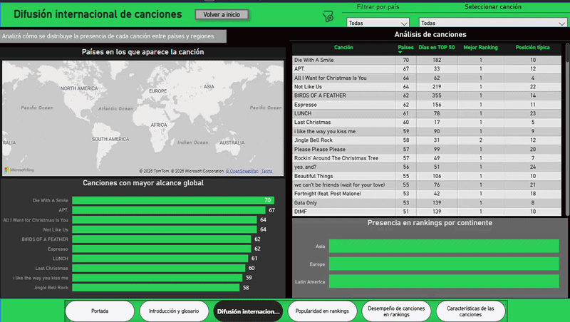
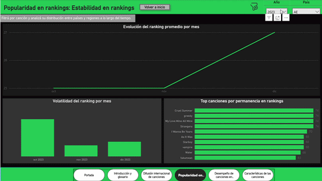
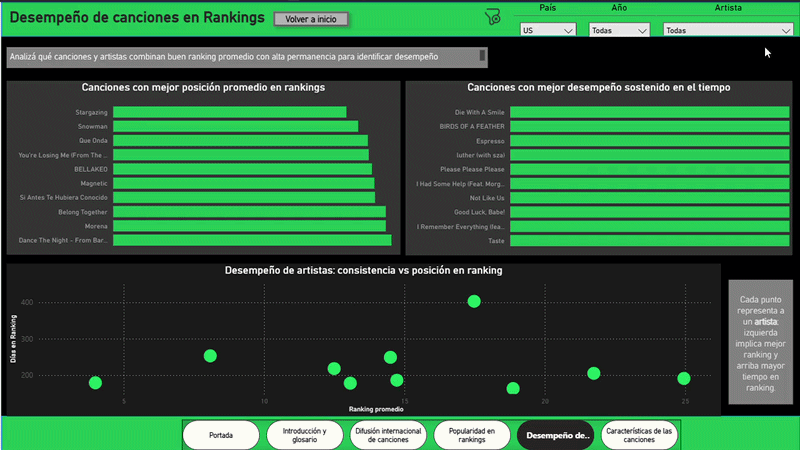
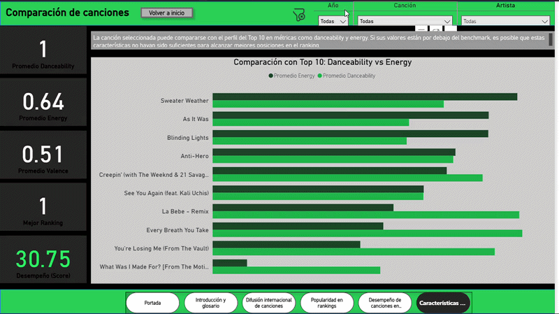

# 🎵 Spotify Global Rankings Analysis | Power BI

Proyecto de análisis de datos desarrollado en Power BI para estudiar la difusión internacional, estabilidad y desempeño de canciones en rankings musicales globales de Spotify.

El proyecto busca comprender cómo se propagan los éxitos musicales entre mercados internacionales, qué características presentan las canciones con mejor desempeño y cómo evolucionan dentro de los rankings a lo largo del tiempo.

---

## 📌 Objetivo general del proyecto

El objetivo principal es analizar el comportamiento de las canciones más populares en Spotify, identificando cómo los hits se difunden desde los principales mercados musicales hacia otros países y qué factores influyen en su permanencia y desempeño dentro de rankings globales.

A través del análisis de popularidad, características musicales, permanencia, estabilidad, difusión internacional y evolución temporal, se busca detectar patrones comunes en canciones exitosas y comprender dinámicas de propagación global.

---

## 🛠 Herramientas utilizadas

- Power BI
- Power Query
- DAX
- Modelado de datos
- Visualización de datos
- Storytelling analítico
- Análisis exploratorio de datos

---
## 🌎 Alcance del análisis

El proyecto trabaja con un dataset basado en rankings musicales de Spotify en más de 70 países.

Cada registro representa una canción en una fecha específica, dentro de un país determinado, con su posición en el ranking y características musicales asociadas.

El análisis contempla:

- Comportamiento temporal de las canciones.
- Diferencias entre mercados y regiones.
- Estabilidad y rotación dentro de rankings.
- Expansión internacional de canciones.
- Relación entre características musicales y desempeño.

---

## 👤 Usuario final y aplicación

El dashboard está orientado a profesionales vinculados a la industria musical, áreas de marketing, comunicación, producción, sellos discográficos y perfiles analíticos interesados en tendencias musicales globales.

El análisis tiene una aplicación táctica, ya que permite generar información útil para campañas de promoción, estrategias de lanzamiento, análisis de mercados y posicionamiento internacional de canciones.

---

## 📌 Dataset

El proyecto fue desarrollado a partir de un dataset de rankings musicales de Spotify, compuesto por registros de canciones presentes en el Top 50 de distintos países.

El dataset permite analizar la evolución de canciones populares a nivel global, considerando información sobre rankings diarios, países, artistas, álbumes y características musicales.

Cada registro permite observar la presencia de una canción en un mercado determinado, en una fecha específica, junto con su posición en el ranking y variables complementarias para el análisis.

**Dataset utilizado:** [Nombre del dataset](PEGAR_LINK_ACÁ)  
**Autor del dataset:** [Asaniczka](PEGAR_LINK_ACÁ)

### Información incluida en el dataset

- Canciones presentes en rankings de Spotify.
- Países donde se publican los rankings.
- Posición diaria de cada canción.
- Variaciones diarias y semanales.
- Información del artista y álbum.
- Características musicales como danceability, energy, valence, tempo, entre otras.

---

## 💡 Hipótesis de trabajo

La hipótesis del proyecto plantea que las canciones más exitosas a nivel global tienden a posicionarse primero en mercados líderes de la industria musical —como Estados Unidos, Reino Unido y Japón— y luego expandirse hacia otros países.

---

---

## 🗂 Modelo de datos

El proyecto fue construido a partir de un modelo relacional que permite conectar información de canciones, artistas, álbumes, países, características musicales y rankings.

El modelo busca organizar los datos de forma clara para facilitar el análisis de desempeño, difusión internacional y evolución temporal de las canciones.

### Diagrama entidad-relación

### Tablas del modelo

#### Tabla: Canción

Contiene la información principal de cada canción disponible en el dataset.

Incluye:
- Identificador único de la canción.
- Nombre de la canción.
- Duración.
- Indicador de contenido explícito.
- Popularidad.
- Relación con artista principal.
- Relación con álbum.

Esta tabla funciona como una de las entidades centrales del modelo, ya que permite vincular el desempeño en rankings con información propia de cada canción.

---

#### Tabla: Artista

Almacena la información de los artistas incluidos en el dataset.

Incluye:
- Identificador único del artista.
- Nombre del artista.

Permite analizar el desempeño no solo a nivel canción, sino también desde una perspectiva de artista.

---

#### Tabla: Álbum

Contiene los datos correspondientes a los álbumes a los que pertenecen las canciones.

Incluye:
- Identificador único del álbum.
- Nombre del álbum.
- Fecha de lanzamiento.

Esta tabla permite complementar el análisis musical con información del lanzamiento y contexto de cada canción.

---

#### Tabla: Características

Incluye las características musicales asociadas a cada canción.

Incluye variables como:
- Danceability.
- Energy.
- Valence.
- Tempo.
- Acousticness.
- Instrumentalness.
- Liveness.
- Speechiness.
- Loudness.
- Mode.
- Key.
- Time signature.

Esta tabla permite analizar si ciertos atributos musicales se relacionan con mejores posiciones, mayor permanencia o mejor desempeño general en rankings.

---

#### Tabla: País

Representa los países o mercados donde se publican los rankings musicales del dataset.

Incluye:
- Identificador único del país.
- Nombre del país o región.
- Continente asignado.

La incorporación del continente permite enriquecer el análisis geográfico y comparar el desempeño de canciones entre distintas regiones del mundo.

---

#### Tabla: Chart

Contiene la información histórica de los rankings diarios de canciones por país y fecha.

Incluye:
- Identificador del registro de ranking.
- Canción rankeada.
- País del ranking.
- Fecha del registro.
- Posición diaria.
- Movimiento diario.
- Movimiento semanal.

Esta tabla es clave para analizar la evolución temporal de las canciones, su permanencia, variaciones de posición y comportamiento dentro de los rankings.

---

#### Tabla: Calendario

Tabla creada para organizar el análisis temporal del proyecto.

Incluye:
- Fecha.
- Año.
- Mes.
- Día.
- Mes año.
- Orden de mes.

Esta tabla permite analizar la evolución de rankings a lo largo del tiempo y ordenar correctamente las visualizaciones temporales.

---

## ⚙️ Transformaciones y preparación de datos

Durante el proceso de preparación de datos se realizaron tareas de limpieza, normalización y modelado para asegurar la consistencia del análisis.

Entre las principales transformaciones se incluyen:

- Tipado correcto de columnas.
- Eliminación de duplicados.
- Normalización de tablas.
- Creación de relaciones entre entidades.
- Creación de tabla calendario.
- Incorporación de variable continente.
- Desarrollo de métricas DAX para análisis de desempeño.

---

# 📊 Dashboards desarrollados

---

## 🌍 Dashboard 1: Difusión internacional de canciones

### Objetivo

Analizar cómo se distribuye la presencia de canciones entre distintos países y regiones del mundo, identificando cuáles logran mayor alcance internacional.

### ¿Qué permite analizar?

Este dashboard permite observar en cuántos países aparece cada canción, qué regiones concentran mayor presencia y cómo se distribuye el desempeño internacional de los principales hits.

También permite complementar el análisis de rankings con una dimensión geográfica, evaluando no solo qué canciones alcanzan buenas posiciones, sino también en qué mercados logran expandirse.

### Métricas utilizadas

- Cantidad de países
- Días en ranking
- Mejor ranking
- Ranking mediana canción
- Presencia por continente

### Visualizaciones incluidas

- Mapa geográfico
- Ranking de canciones con mayor alcance global
- Tabla comparativa por canción
- Presencia en rankings por continente
- Filtros por país y canción

### Valor analítico

Este panel ayuda a identificar canciones con mayor difusión global y permite comparar si el alcance internacional se relaciona con la permanencia o con las mejores posiciones alcanzadas en rankings.

---

## 📈 Dashboard 2: Popularidad y estabilidad en rankings

### Objetivo

Estudiar la dinámica de los rankings musicales dentro de un mercado y período determinado, analizando estabilidad, permanencia y volatilidad.

### ¿Qué permite analizar?

Este dashboard permite observar cómo evoluciona el ranking promedio a lo largo del tiempo, qué canciones permanecen más días dentro de los rankings y qué tan variable es el comportamiento de las posiciones mes a mes.

El foco está puesto en entender si un ranking presenta estabilidad o alta rotación, y qué canciones logran sostenerse durante más tiempo.

### Métricas utilizadas

- Días en ranking
- Movimiento semanal promedio
- Ranking promedio mensual
- Volatilidad del ranking
- Permanencia por canción

### Visualizaciones incluidas

- Evolución del ranking promedio por mes
- Volatilidad mensual
- Top canciones por permanencia
- Filtros por año y país

### Valor analítico

Este panel permite diferenciar canciones que tienen apariciones breves de aquellas que logran sostener su presencia en rankings. También ayuda a analizar la estabilidad de un mercado musical específico.

---

## 🎤 Dashboard 3: Desempeño de canciones en rankings

### Objetivo

Evaluar qué canciones y artistas combinan buenas posiciones con alta permanencia en rankings para identificar desempeño sostenido en el tiempo.

### ¿Qué permite analizar?

Este dashboard permite comparar canciones según su ranking promedio y sus días de permanencia, diferenciando aquellas que alcanzan buenas posiciones de forma puntual de aquellas que logran mantener un rendimiento consistente.

También permite observar el desempeño de artistas a partir de la relación entre posición promedio y permanencia en rankings.

### Métricas utilizadas

- Score de desempeño
- Días en ranking
- Ranking promedio
- Mejor posición promedio
- Permanencia por artista

### Visualizaciones incluidas

- Canciones con mejor posición promedio
- Canciones con mejor desempeño sostenido
- Scatter plot de artistas
- Filtros por país, año y artista

### Valor analítico

Este panel permite identificar canciones con rendimiento sólido, no solo por alcanzar buenas posiciones, sino por sostenerse en el tiempo. Esto aporta una mirada más completa del éxito musical.

---

## 🎧 Dashboard 4: Características musicales de canciones

### Objetivo

Comparar las características musicales de canciones seleccionadas con el perfil del Top 10 para analizar si ciertos atributos se asocian con mejores desempeños en rankings.

### ¿Qué permite analizar?

Este dashboard permite evaluar métricas musicales como danceability, energy y valence, comparándolas contra canciones con mejor desempeño.

El objetivo es observar si las canciones mejor posicionadas comparten ciertos patrones musicales o si existen diferencias relevantes entre la canción seleccionada y el benchmark del Top 10.

### Métricas utilizadas

- Promedio Danceability
- Promedio Energy
- Promedio Valence
- Mejor ranking
- Score de desempeño

### Visualizaciones incluidas

- KPIs principales
- Comparación Danceability vs Energy
- Benchmark contra Top 10
- Filtros por año, canción y artista

### Valor analítico

Este panel permite incorporar una dimensión musical al análisis de desempeño, conectando características de audio con resultados obtenidos en rankings.

---

# 🛠 Herramientas utilizadas

- Power BI
- Power Query
- DAX
- Modelado de datos
- Visualización de datos
- Storytelling analítico

---

# 📁 Archivos incluidos

Este repositorio contiene:

- Archivo `.pbix`
- Exportación del dashboard en PDF
- Capturas de pantalla de cada dashboard
- README descriptivo
- Recursos visuales del proyecto

---
# 📌 Dataset

Dataset utilizado con fines educativos y analíticos para explorar el comportamiento de rankings musicales globales de Spotify.

---

# 👩‍💻 Autora

**Agustina Landoni**

Licenciada de Relaciones Públicas con interés en:

- Data Analytics
- Business Intelligence
- Storytelling con datos
- Comunicación estratégica
- Visualización de información

---

# 🚀 Proyecto desarrollado en Power BI

Portfolio personal orientado a análisis de datos y visualización interactiva.
